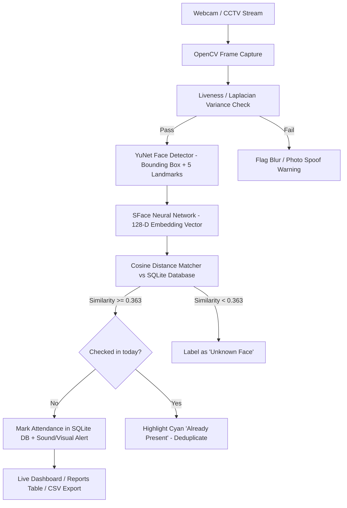

# 🎓 AI Real-Time Facial Attendance & Analytics System

An end-to-end Computer Vision attendance management system powered by **OpenCV Deep Neural Networks (YuNet + SFace)**, **Python**, **Flask**, and **SQLite**.

---

## 🚀 Key Features

- **Real-Time Facial Recognition**: Live 30+ FPS face detection and 128-dimensional biometric feature matching.
- **Anti-Spoofing & Liveness Detection**: Blur / Laplacian variance checks to prevent photo/screen spoofing.
- **Automated Attendance Logging**: Automatically logs student name, roll number, department, time, and confidence score.
- **Strict Duplicate Prevention**: Unique constraint guarantees a student cannot be logged multiple times on the same date.
- **Modern Web Dashboard**: Glassmorphic dark UI with live streaming MJPEG feed, KPI statistics, and real-time attendance polling.
- **Student Enrollment Hub**: Add students via live webcam snapshot directly in the browser or via image upload.
- **Auditing & Analytics**: Date-range filtering, department filtering, per-student attendance percentage calculation, and CSV report export.
- **Dual Runtime Modes**: Run either as a full web application (`app.py`) or as a native desktop window (`run_desktop.py`).

---

## 🏛️ Project Architecture



---

## 🧠 OpenCV Theory Reference

| Topic | Theory Concept | Where Implemented |
|---|---|---|
| **Image & Matrix** | Grayscale, BGR channels, pixel matrices | `face_engine.py` |
| **Video Streaming** | `cv2.VideoCapture()`, threaded frame capture | `attendance.py` (`VideoStream`) |
| **Face Detection** | Deep Neural Network `cv2.FaceDetectorYN` (YuNet) | `face_engine.py` (`detect_faces`) |
| **Face Recognition** | 128-D feature embeddings via `cv2.FaceRecognizerSF` | `face_engine.py` (`extract_feature`) |
| **Cosine Metric** | Hyperspace vector similarity $\ge 0.363$ | `face_engine.py` (`match_face`) |
| **HUD & Coordinates** | `(x, y, w, h)` bounding boxes with status tags | `face_engine.py` (`draw_face_hud`) |
| **Anti-Spoofing** | Laplacian variance edge texture check | `face_engine.py` (`check_liveness`) |
| **Attendance Logic** | Deduplication via `UNIQUE(roll_number, date)` | `database.py` (`mark_attendance`) |

---

## 📂 Project Structure

```
AI_Attendance/
├── app.py                      # Flask web application & REST APIs
├── attendance.py               # Video capture thread & attendance debounce logic
├── database.py                 # SQLite database schemas, queries & analytics
├── face_engine.py              # OpenCV YuNet detection & SFace recognition engine
├── run_desktop.py              # Standalone OpenCV desktop window runner
├── requirements.txt            # Python dependencies
│
├── dataset/                    # Stored cropped student face photos
├── models/                     # ONNX Neural Network models
│   ├── face_detection_yunet.onnx
│   ├── face_recognition_sface.onnx
│   └── haarcascade_frontalface_default.xml
│
├── templates/                  # Frontend HTML templates
│   ├── base.html               # Base navigation and theme
│   ├── dashboard.html          # Live feed, KPI cards, real-time table
│   ├── students.html           # Enrollment modal & student directory
│   ├── reports.html            # Attendance logs, student % & CSV export
│   └── theory.html             # Interactive OpenCV theory curriculum
│
└── static/
    ├── css/style.css           # Styling & animations
    └── js/main.js              # Live clock & toast alerts
```

---

## ⚡ How to Run

### Deploy on Render

1. In Render, choose **New** &rarr; **Blueprint** and connect this GitHub repository. Leave **Root Directory** blank.
2. Render reads `render.yaml` and configures the build and start commands. Enter values for `ADMIN_USERNAME` and `ADMIN_PASSWORD` when prompted; Render generates `FLASK_SECRET_KEY`.
3. Deploy the free web service.

The free service uses temporary storage, so attendance records and enrolled students may be lost when it restarts. Live recognition requests permission to use the browser device camera and sends sampled frames to the server over HTTPS for processing. Keep in mind that the free service's limited CPU may make recognition slower than running locally.

### Option 1: Web Dashboard (Recommended)

1. Open PowerShell in `e:\AI_Attendence_system`.
2. Configure a session key and initial admin credentials in this terminal:
   ```powershell
   $env:FLASK_SECRET_KEY = python -c "import secrets; print(secrets.token_hex(32))"
   $env:ADMIN_USERNAME = "admin"
   $securePassword = Read-Host "Choose an admin password" -AsSecureString
   $env:ADMIN_PASSWORD = [System.Net.NetworkCredential]::new("", $securePassword).Password
   ```
   The admin credentials are used only when creating a new database. Keep the session key and password private.
3. Run:
   ```bash
   python app.py
   ```
4. Open your browser and navigate to:
   ```
   http://127.0.0.1:5000
   ```
5. Go to **Students** &rarr; **Register New Student** to enroll your face using your webcam or photo.
6. Watch the **Dashboard** recognize you in real time and automatically log your attendance!

### Option 2: Native Desktop Window

To run without a web browser directly in a pure OpenCV window:
```bash
python run_desktop.py
```
Press **`q`** or **`ESC`** to exit.
